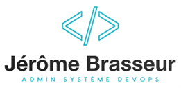

# 

## Auteur

👤**Jérôme BRASSEUR**

* Github: [@Jérôme Brasseur](https://github.com/jeromebrasseur)
* LinkedIn: [@Jérôme Brasseur](https://www.linkedin.com/in/jeromebrasseur92000)

***

### 📎 Bachelor Administrateur Système DevOps 

_`Début du projet le 01/11/2024`_

***

<!-- TABLE DES MATIÈRES -->

  
<h2 style="display: inline-block">Table des matières</h2>

  <ol>
    <li><a href="#a-propos-du-la-formation">A propos de la formation</a></li>
    <li><a href="#les-outils-devops">Les outils DevOps</a></li>
    <li><a href="#utilisé-dans-les-projets">Utilisé dans les projets</a></li>
    <li><a href="#remerciements">Remerciements</a></li>
  </ol>

 

<!-- A PROPOS DU BOOTCAMP -->
## A propos de la formation

La formation est dispensée par [Studi](https://www.studi.com/fr/formation/infrastructures-et-systemes/bachelor-administrateur-systeme-devops).

Le DevOps repose sur un ensemble de principes visant à fluidifier les relations entre les développeurs et les opérationnels en charge du déploiement de la production informatique.

Objectif : accélérer les processus de développement et déploiement tout en améliorant la qualité des produits.

Grâce à cette formation, vous deviendrez un professionnel de l’automatisation du déploiement des infrastructures sur un cloud privé, public ou hybride.  Vous saurez, en relation avec les équipes de développeurs, déployer des applications en continu.

<!-- PROGRAMME DE LA FORMATION -->

  
Programme de la formation

   
  <ol>
    <li>
      <a>Automatisation du déploiement d'infrastructure dans le Cloud</a>
      <ul>
        <li><a>Gérer son projet en mode agile</a></li>
        <li><a>Maintenir et exploiter un serveur linux</a></li>
        <li><a>Créer automatiquement des serveurs grâce aux scripts</a></li>
        <li><a>Déployer automatiquement une infrastructure</a></li>
        <li><a>Sécuriser votre infrastructure</a></li>
        <li><a>Superviser l'infrastructure</a></li>
        <li><a>Mettre votre infrastructure en production dans le Cloud</a></li>
      </ul>
    </li>
    <li>
      <a>Déploiement d'une application en continu</a>
      <ul>
        <li><a>Préparer un environnement de test</a></li>
        <li><a>Gérer le stockage des données</a></li>
        <li><a>Gérer des containers</a></li>
        <li><a>Automatiser la mise en production</a></li>
      </ul>
    </li>
    <li>
      <a>Supervision des services déployés</a>
      <ul>
        <li><a>Définir et mettre en place des statistiques de services</a></li>
        <li><a>Superviser la disponibilité de l’infrastructure et en présenter les résultats</a></li>
        <li><a>Exploiter une solution de supervision</a></li>
        <li><a>Mesurer les performances et la disponibilité de l’infrastructure et en présenter les résultats</a></li>
        <li><a>Assurer sa veille technologique</a></li>
        <li><a>Échanger en Anglais sur les réseaux professionnels</a></li>
      </ul>
    </li>
   
  </ol>

 

À l’issue de la formation, vous obtenez le Titre Professionnel niveau 6 “Administrateur système DevOps”.

 

<!-- LES OUTILS DEVOPS -->
## Les outils DevOps

Durant la formation, des cours théoriques et des ateliers pratiques permettent aux apprenants de développer leurs compétences sur les outils suivants :

* [![Docker][Docker.com]][Docker-url]
* [![Gitlab][Gitlab.com]][Gitlab-url]
* [![Jenkins][Jenkins.io]][Jenkins-url]
* [![Terraform][Terraform.com]][Terraform-url]
* [![Ansible][Ansible.com]][Ansible-url]
* [![Kubernetes][Kubernetes.io]][Kubernetes-url]

 

<!-- EXEMPLES D'UTILISATION -->
## Utilisé dans les projets

Cette section liste les principaux systèmes et applications utilisés dans les différents projets.

| Systèmes   | Base de données   | Langages   | Editeur de code   | Virtualisation  | Cloud         | Travail collaboratif  |
| :--------: |:--------------:   |:---------: |:---------------:  |:-------------:  |:----------:   |:------------------:   |
| [![Ubuntu][Ubuntu.com]][Ubuntu-url] | [![MariaDB][MariaDB.org]][MariaDB-url] | [![Bash][Bash.com]][Bash-url] | [![Vim][Vim.org]][Vim-url] | [![Vagrant][Vagrant.com]][Vagrant-url] | [![Aws][Aws.com]][Aws-url] | [![Github][Github.com]][Github-url] |
| [![Debian][Debian.org]][Debian-url] | [![MySQL][MySQL.com]][MySQL-url] | [![Python][Python.org]][Python-url] | [![VScode][VScode.com]][VScode-url] | [![Virtualbox][Virtualbox.org]][Virtualbox-url] | [![Hostinger][Hostinger.com]][Hostinger-url] | [![Slack][Slack.com]][Slack-url] |
| [![Windows][Windows.com]][Windows-url] |                                     | [![Yaml][Yaml.org]][Yaml-url]       |           |          |          |

 

<!--Remerciements -->
## Remerciements

* [Studi](https://www.studi.com/fr)
* [Ala ATRASH](https://github.com/alaatrash)
* [Majd SALEH](https://github.com/majd-saleh)
* Stella ROULIERE

 

**[⬆ Retour en haut](#auteur)**  

<!-- MARKDOWN LINKS & IMAGES -->
<!-- https://www.markdownguide.org/basic-syntax/#reference-style-links -->
[Docker.com]: https://img.shields.io/badge/Docker-2496ED?logo=docker&logoColor=fff
[Docker-url]: https://docker.com/
[Gitlab.com]: https://img.shields.io/badge/GitLab%20CI-FC6D26?logo=gitlab&logoColor=fff
[Gitlab-url]: https://gitlab.com/
[Jenkins.io]: https://img.shields.io/badge/Jenkins-D24939?logo=jenkins&logoColor=white
[Jenkins-url]: https://jenkins.io/
[Kubernetes.io]: https://img.shields.io/badge/Kubernetes-326CE5?logo=kubernetes&logoColor=fff
[Kubernetes-url]: https://kubernetes.io/
[Ansible.com]: https://img.shields.io/badge/Ansible-000?logo=ansible&logoColor=fff
[Ansible-url]: https://svelte.dev/
[Terraform.com]: https://img.shields.io/badge/Terraform-734F96?logo=terraform&logoColor=fff
[Terraform-url]: https://developer.hashicorp.com/terraform
[Ubuntu.com]: https://img.shields.io/badge/Ubuntu-E95420?logo=ubuntu&logoColor=white
[Ubuntu-url]: https://ubuntu.com
[Debian.org]: https://img.shields.io/badge/Debian-A81D33?logo=debian&logoColor=fff
[Debian-url]: https://debian.org
[Windows.com]: https://custom-icon-badges.demolab.com/badge/Windows-0078D6?logo=windows11&logoColor=white
[Windows-url]: https://windows.com
[Aws.com]: https://img.shields.io/badge/AWS-%23FF9900.svg?logo=amazon-web-services&logoColor=white
[Aws-url]: https://aws.amazon.com
[Hostinger.com]: https://img.shields.io/badge/Hostinger-673DE6?logo=hostinger&logoColor=fff
[Hostinger-url]: https://hostinger.com
[Vim.org]: https://img.shields.io/badge/Vim-%2311AB00.svg?logo=vim&logoColor=white
[Vim-url]: https://vim.org
[VScode.com]: https://custom-icon-badges.demolab.com/badge/Visual%20Studio%20Code-0078d7.svg?logo=vsc&logoColor=white
[VScode-url]: https://code.visualstudio.com
[MariaDB.org]: https://img.shields.io/badge/MariaDB-003545?logo=mariadb&logoColor=white
[MariaDB-url]: https://mariadb.org
[MySQL.com]: https://img.shields.io/badge/MySQL-4479A1?logo=mysql&logoColor=fff
[MySQL-url]: https://mysql.com
[Bash.com]: https://img.shields.io/badge/Bash-4EAA25?logo=gnubash&logoColor=fff
[Bash-url]: https://fr.wikipedia.org/wiki/Bourne-Again_shell
[Python.org]: https://img.shields.io/badge/Python-3776AB?logo=python&logoColor=fff
[Python-url]: https://python.org
[Yaml.org]: https://img.shields.io/badge/YAML-CB171E?logo=yaml&logoColor=fff
[Yaml-url]: https://yaml.org
[Github.com]: https://img.shields.io/badge/GitHub-%23121011.svg?logo=github&logoColor=white
[Github-url]: https://github.com
[Slack.com]: https://img.shields.io/badge/Slack-4A154B?logo=slack&logoColor=fff
[Slack-url]: https://app.slack.com
[Vagrant.com]: https://img.shields.io/badge/Vagrant-3668FF?logo=vagrant&logoColor=fff
[Vagrant-url]: https://developer.hashicorp.com/vagrant
[Virtualbox.org]: https://img.shields.io/badge/VirtualBox-FE7A16?logo=virtualbox&logoColor=fff
[Virtualbox-url]: https://virtualbox.org
